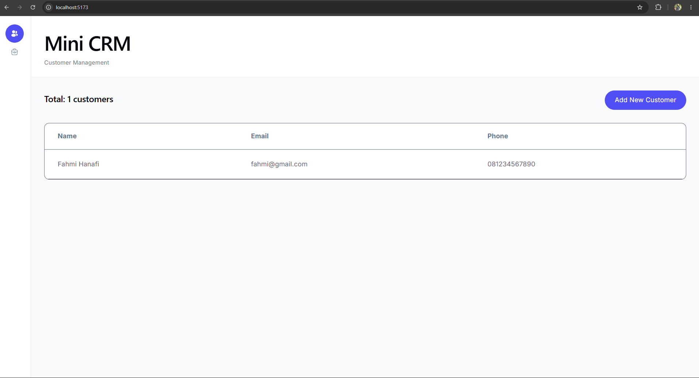
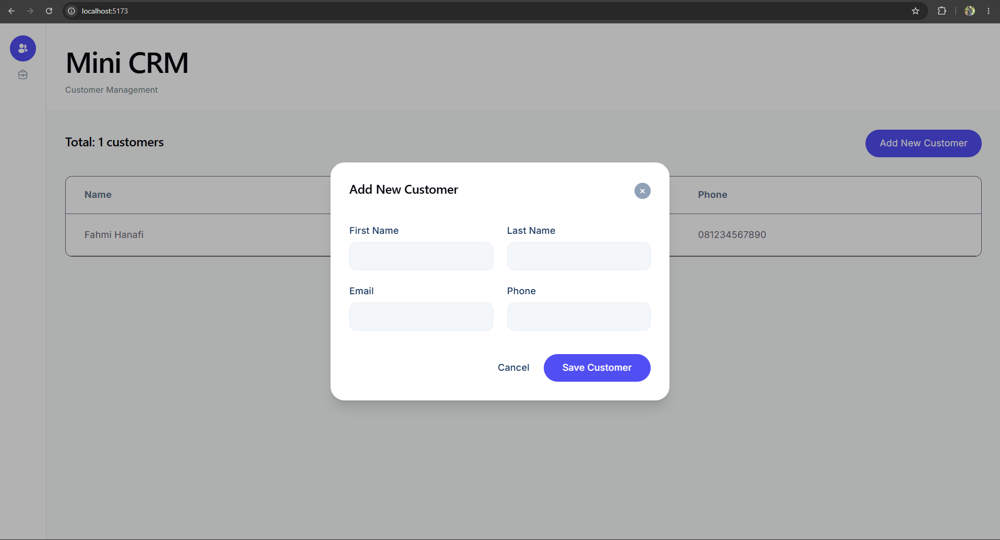
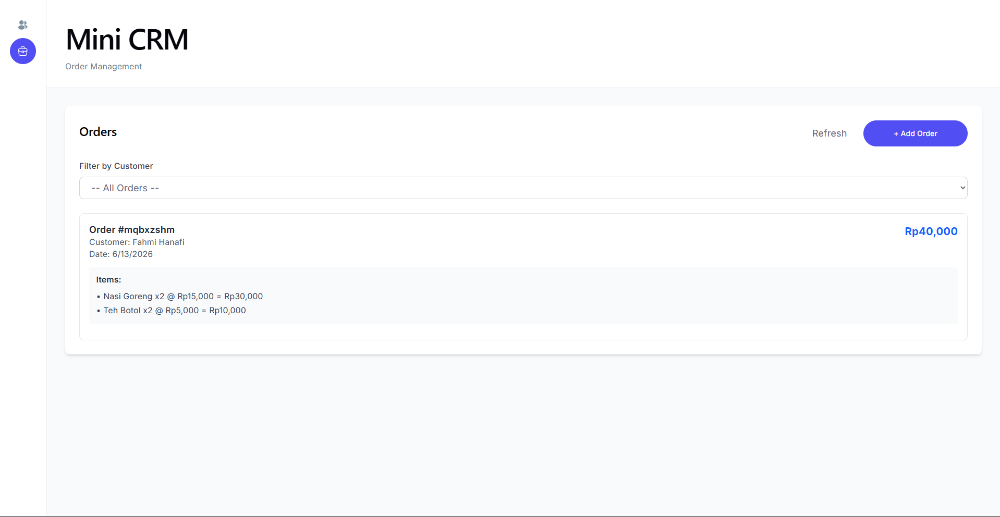
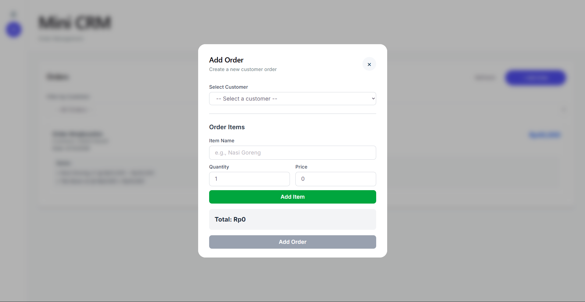

# Mini CRM untuk UMKM Kuliner

Sistem CRM sederhana untuk membantu pemilik warung kuliner mencatat data pelanggan dan pesanan agar bisa memberikan penawaran yang tepat dan menganalisis perilaku pelanggan.

## 📋 Fitur Utama
| | |
| :---: | :---: |
|  |  |
|  |  |

### Backend API
- **POST /customers** - Tambah customer baru dengan nama, email, dan nomor telepon
- **GET /customers** - Ambil daftar semua customer
- **POST /orders** - Tambah order baru untuk customer tertentu dengan daftar item dan total harga
- **GET /orders?customerId=** - Ambil semua order milik customer tertentu

### Frontend
- 📝 **Form Tambah Customer** - Interface untuk menambahkan customer baru
- 📝 **Form Tambah Order** - Interface untuk membuat order dengan multiple items
- 👥 **Daftar Customer** - Tampilkan semua customer dengan detail lengkap
- 📦 **Daftar Order** - Tampilkan semua order dengan kemampuan filter per customer
- 💾 **Data Persistence** - Gunakan localStorage untuk menyimpan data client-side

## 🏗️ Arsitektur

```
mini-crm/
├── backend/
│   ├── src/
│   │   ├── controllers/       # Business logic handlers
│   │   │   ├── customerController.ts
│   │   │   └── orderController.ts
│   │   ├── middleware/        # Express middleware
│   │   │   └── validation.ts
│   │   ├── models/            # TypeScript interfaces
│   │   │   └── types.ts
│   │   ├── routes/            # API endpoints
│   │   │   ├── customerRoutes.ts
│   │   │   └── orderRoutes.ts
│   │   ├── utils/             # Helper functions
│   │   │   └── database.ts
│   │   └── index.ts           # Express app setup
│   ├── db.json                # JSON database file
│   ├── package.json
│   ├── tsconfig.json
│   └── .env.example
│
└── frontend/
    ├── src/
    |   ├── assets/
    │   │   ├── customer-active.svg
    │   │   ├── customer-inactive.svg
    │   │   ├── order-active.svg
    │   │   └── order-inactive.svg
    │   │
    │   ├── components/        # React components
    │   │   ├── AddCustomerForm.tsx
    │   │   ├── CustomerList.tsx
    │   │   ├── AddOrderForm.tsx
    │   │   ├── OrderList.tsx
    │   │   └── ErrorBoundary.tsx
    │   ├── context/           # Context API
    │   │   └── CRMContext.tsx
    │   ├── services/          # API calls
    │   │   └── api.ts
    │   ├── App.tsx
    │   ├── index.css
    │   └── main.tsx
    ├── package.json
    ├── tsconfig.json
    ├── tailwind.config.js
    ├── postcss.config.js
    ├── vite.config.ts
    └── .env.example
```

## 🛠️ Tech Stack

### Backend
- **Runtime**: Node.js
- **Language**: TypeScript
- **Framework**: Express.js
- **Database**: JSON file (db.json)
- **Package Manager**: npm

### Frontend
- **Framework**: React 19
- **Language**: TypeScript
- **Build Tool**: Vite
- **Styling**: Tailwind CSS
- **HTTP Client**: Axios
- **State Management**: Context API + localStorage

## 📦 Installation

### Prerequisites
- Node.js v16+ dan npm

### Backend Setup
```bash
cd backend
cp .env.example .env
npm install
```

### Frontend Setup
```bash
cd frontend
cp .env.example .env
npm install
npm install -D tailwindcss postcss autoprefixer @tailwindcss/postcss
```

## 🚀 Running the Application

### Start Backend Server
```bash
cd backend
npm run dev
```
Server akan berjalan di `http://localhost:3000`

### Start Frontend Development Server
```bash
cd frontend
npm run dev
```
Frontend akan berjalan di `http://localhost:5173`

Buka browser dan kunjungi `http://localhost:5173`

## 📚 API Documentation

### Customers

#### Add Customer
```
POST /customers
Content-Type: application/json

{
  "name": "Budi Santoso",
  "email": "budi@example.com",
  "phone": "081234567890"
}

Response (201):
{
  "message": "Customer added successfully",
  "customer": {
    "id": "unique_id",
    "name": "Budi Santoso",
    "email": "budi@example.com",
    "phone": "081234567890",
    "createdAt": "2024-01-15T10:30:00Z"
  }
}
```

#### Get All Customers
```
GET /customers

Response (200):
[
  {
    "id": "unique_id",
    "name": "Budi Santoso",
    "email": "budi@example.com",
    "phone": "081234567890",
    "createdAt": "2024-01-15T10:30:00Z"
  }
]
```

### Orders

#### Add Order
```
POST /orders
Content-Type: application/json

{
  "customerId": "customer_unique_id",
  "items": [
    {
      "name": "Nasi Goreng",
      "quantity": 2,
      "price": 15000
    },
    {
      "name": "Teh Botol",
      "quantity": 2,
      "price": 5000
    }
  ],
  "totalPrice": 40000
}

Response (201):
{
  "message": "Order added successfully",
  "order": {
    "id": "unique_order_id",
    "customerId": "customer_unique_id",
    "items": [...],
    "totalPrice": 40000,
    "createdAt": "2024-01-15T11:00:00Z"
  }
}
```

#### Get Orders by Customer
```
GET /orders?customerId=customer_unique_id

Response (200):
[
  {
    "id": "unique_order_id",
    "customerId": "customer_unique_id",
    "items": [...],
    "totalPrice": 40000,
    "createdAt": "2024-01-15T11:00:00Z"
  }
]
```

## 🔄 Data Flow

```
Frontend Form Input
↓
Client Validation
↓
Axios Request
↓
Express API
↓
Validation Middleware
↓
Controller
↓
db.json
↓
API Response
↓
Context Update
↓
Component Re-render
```
